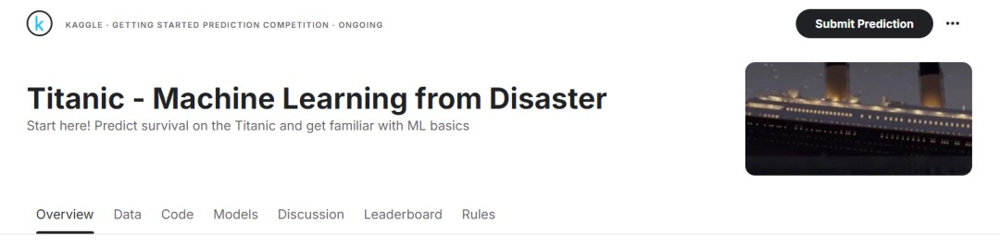

# Titanic Survival Prediction with Machine Learning

### Kaggle Competition: Titanic - Machine Learning from Disaster

This notebook focuses on the Titanic dataset to predict whether a passenger survived or not, using various classification algorithms. We compare multiple machine learning models based on accuracy and ROC AUC metrics, followed by saving the best-performing model.

---

## Steps Outline:

1. **Understanding the Data**:
   - Explore the Titanic dataset, understand the features, and define the target variable.
   - Identify and handle missing values, outliers, and inconsistencies in the dataset.

2. **Exploratory Data Analysis (EDA)**:
   - Analyze and visualize the dataset to understand relationships between features.
   - Identify missing values, outliers, and correlations.

3. **Data Preprocessing**:
   - Impute missing values using `SimpleImputer`.
   - Scale numeric features using `RobustScaler`.
   - Apply one-hot encoding for categorical variables.
   - Use `ColumnTransformer` to combine these steps.

4. **Modeling and Comparison**:
   - Train and evaluate the following models:
     - Logistic Regression
     - Random Forest
     - Support Vector Machine
     - K-Nearest Neighbors
     - Decision Tree
     - Gradient Boosting
   - Compare models using **Accuracy** and **ROC AUC**.

5. **Model Selection**:
   - **Random Forest** was chosen for its highest **ROC AUC** (0.8923), indicating the best balance between accuracy and the ability to distinguish between classes.

6. **Model Saving**:
   - Save the Random Forest model using `joblib` for deployment.

7. **Submission**:
   - Generate predictions on the test set and prepare `submission.csv` for Kaggle submission.

---

## Understanding the Data

The Titanic dataset contains demographic and travel-related information for passengers aboard the Titanic. The goal is to predict whether a passenger survived the disaster (target variable: `Survived`).

### Key Features:
- **PassengerId**: Unique identifier for each passenger.
- **Pclass**: Passenger's class (1st, 2nd, 3rd).
- **Name**: Passenger's name.
- **Sex**: Passenger's gender (male or female).
- **Age**: Passenger's age.
- **SibSp**: Number of siblings or spouses aboard the Titanic.
- **Parch**: Number of parents or children aboard the Titanic.
- **Ticket**: Ticket number.
- **Fare**: Passenger's fare.
- **Cabin**: Cabin number.
- **Embarked**: Port of embarkation (C = Cherbourg, Q = Queenstown, S = Southampton).

### Target Variable:
- **Survived**: 1 if the passenger survived, 0 if not.

### Approach:
- **Identify Missing Values**: Missing values are present in the `Age`, `Cabin`, and `Embarked` columns. We'll impute the missing data using appropriate strategies (median for numerical, most frequent for categorical).
- **Understand the Data Distributions**: Visualize key variables like `Age`, `Fare`, `Pclass`, and their correlation with `Survived` to understand their impact on the target.
- **Feature Engineering**: Create new features like `FamilySize` to enhance the model's predictive power.

---

## Exploratory Data Analysis (EDA)

### Visualizations:
- Passenger class distribution (`Pclass`).
- Age distribution, including missing values.
- Survival distribution by sex, age, and class.
- Family size and its correlation with survival (`FamilySize` feature derived from `SibSp` and `Parch`).

### Family Size Definition:
- **FamilySize** is calculated as the sum of siblings/spouses (`SibSp`) and parents/children (`Parch`), plus 1 (representing the passenger themselves).

---

## Data Preprocessing

### Missing Values Imputation:
- Missing values in the `Age`, `Fare`, and `Embarked` columns are handled using appropriate imputation strategies (`median` for numeric data, `most frequent` for categorical data).

### Feature Scaling:
- We use **RobustScaler** to scale numeric features, making the model more robust to outliers.

### Column Transformer:
- The column transformer applies different transformations to numerical and categorical features, ensuring an efficient preprocessing pipeline.

---

## Model Training and Performance Comparison

Several classification algorithms were evaluated after preprocessing:

| Model                   | Accuracy | ROC AUC |
|-------------------------|----------|---------|
| Logistic Regression      | 0.8101   | 0.8826  |
| Random Forest            | 0.8045   | 0.8923  |
| Support Vector Machine   | 0.8101   | 0.8286  |
| K-Nearest Neighbors      | 0.8156   | 0.8588  |
| Decision Tree            | 0.7935   | 0.8165  |
| Gradient Boosting        | 0.8045   | 0.8879  |

## Analysis:

#### 1. Accuracy:
- **Best:** K-Nearest Neighbors (`0.8156`)
- SVM and Logistic Regression also perform well with an accuracy of `0.8101`.

#### 2. ROC AUC:
- **Best:** Random Forest (`0.8923`)
- Gradient Boosting is close behind with a ROC AUC of `0.8879`.

### Model Selection: Random Forest

Given the high ROC AUC, Random Forest was chosen as the final model for deployment.

---

## Saving the Model

We saved the Random Forest model using `joblib` for future use.

---

## Submission

Predictions were generated on the test set, and a `submission.csv` file was created for submission to the Kaggle competition.

---

## Conclusion

- **Random Forest** emerged as the best model with the highest ROC AUC of `0.8923`, indicating its superior ability to distinguish between survivors and non-survivors.
- Although **K-Nearest Neighbors** achieved the highest accuracy at `0.8156`, its ROC AUC was slightly lower compared to Random Forest.
- The Random Forest model was selected for deployment due to its balance of high accuracy and ROC AUC performance.
- The model was saved for future use, and predictions were generated and submitted for the Kaggle competition.
